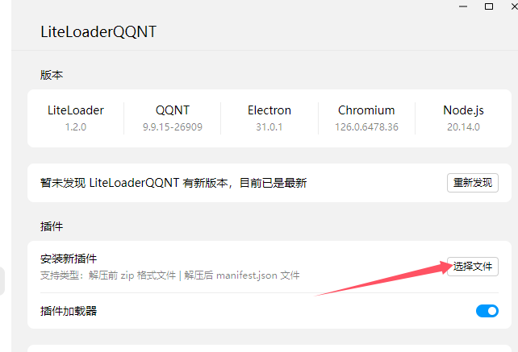

# 快速开始

NapCatQQ V2 正式开始测试，欢迎来到 NapCatQQ (aka 猫猫框架) 的使用文档！

## 使用之前

在开始使用之前，你需要了解以下内容。

::: details 猫猫框架的原理是什么，能够做些什么？

猫猫框架通过魔法的手段获得了 QQ 的发送消息、接收消息等接口，为了方便使用，猫猫框架将通过一种名为 [OneBot](https://11.onebot.dev) 的约定将你的 HTTP / WebSocket 请求按照规范读取，再去调用猫猫框架所获得的QQ发送接口之类的接口。

:::

## 如何使用

前往 [NapCatQQ 的 release 页面](https://github.com/NapNeko/NapCatQQ/releases)，各位可以看到有两个压缩包，
文件名后缀分别为 `Shell` 和 `Framework`，应当如何选择呢？
这就需要了解猫猫框架的启动方式了。

1. [方法 1](#方法1-作为-liteloader-插件启动) 作为 [LiteLoaderQQNT](https://liteloaderqqnt.github.io/) 插件运行，可以实现“人机合一”。

2. [方法 2](#方法2-通过命令行启动) 通过命令行启动，当你不需要或没有图形化界面，或者内存紧张，可以使用此方法。

3. [方法 3](#方法3-only-gui) “Only GUI” 模式，当你不想使用 LiteLoader 插件时，却又想人机合一，又想折腾时，可以考虑此方法。

方法 1 和 3 都是“有头启动”，应当使用 Framework 版本；方法 2 是无头启动，应当使用 Shell 版本。我们目前对方法 1 和 2 有较为完整的文档支持，方法 3 还请自行探索。


### 方法1: 作为 LiteLoader 插件启动
#### 手动撸猫
::: details 通过LiteLoader框架安装Framerwork版本Napcat
**请安装27597或者更高版本 注意如果28060及以上有困难尝试27597**
1. 按照 [LiteLoaderQQNT 官网](https://liteloaderqqnt.github.io/) 的指导安装 LiteLoaderQQNT 框架。

2. 在 LiteLoaderQQNT 的设置页面（如下图）将 `NapCat.Framework.zip` 导入即可。

:::
#### 一键撸猫
::: details Framerwork Linux Docker
前往仓库了解

[NapCat.Docker.Framerwrok](https://github.com/NapNeko/NapCat.Docker.Framerwrok)
:::

### 方法2: 通过命令行启动
频繁掉线可以采用方式1

#### 一键撸猫


::: details Windows X64 自动化安装程序

[前往下载](https://github.com/NapNeko/NapCat-Win-Installer/releases/tag/v1.0.0)

复制到你需要的目录双击启动程序 即可 如果存在问题 请前往官方群和issue反馈 并尝试下面的方案

安装完成 双击目录下launcher.bat即可启动 如果是win10 则使用launcher-win10.bat

修改配置见本文最后 NapCat 的基础设置 同时 你可以也可以使用 图形化WebUi远程配置 

注意 如果需要快速登录 命令行执行 或者 新建bat

Win11: `.\launcher.bat 123456`

Win 10: `.\launcher-win10.bat 123456`

:::

::: details Windows图形化部署与管理工具 (测试版本)
警告 此方案 可能存在一些奇妙bug 因为刚刚打完复活赛 如果失败使用上面方案

[源码仓库](https://github.com/NapNeko/NapCatQQ-Desktop)

[下载工具](https://github.com/NapNeko/NapCatQQ-Desktop/releases)

如果存在问题 请前往官方群和issue反馈 并尝试其余的方案
:::

::: details Linux 一键脚本 (适用于 Ubuntu **20+** / Debian **10+** / CentOS **9**)

``` bash
curl -o napcat.sh https://nclatest.znin.net/NapNeko/NapCat-Installer/main/script/install.sh && sudo bash napcat.sh
```

:::

::: details Linux 下使用 Docker

用不来怎么办？ [点我前往不知名的友人提供的教程](https://www.xinz.fun/archives/Napcat)

[使用 NapCat-Docker](https://github.com/NapNeko/NapCat-Docker)

:::

::: details Termux 一键脚本

``` bash
curl -o napcat.termux.sh https://nclatest.znin.net/NapNeko/NapCat-Installer/main/script/install.termux.sh && bash napcat.termux.sh
```

:::

::: details 在 Railway 上部署

[](https://railway.app/template/aRUNRZ?referralCode=Ns2Kracy)

:::

::: details 在 1Panel 通过插件部署

[前往插件仓库](https://github.com/Fahaxikiii/napcat-1panel)

通过1Panel插件 简单部署NapCatQQ 注意此方案并非官方维护

:::
#### 手动/半自动撸猫

<!-- 目前已经研究完成并公布的启动方式有 BootWay03 和 05。

[前往了解 BootWay05 手动方案](./boot/shell/BootWay05)（仅适用于 Windows x64）

[前往了解 BootWay03 半自动方案](./boot/shell/BootWay03-Linux-SemiAuto.md)（适用于 Deb / Red Hat 系**以外**的 Linux 发行版）

[前往了解 BootWay03 手动方案](./boot/shell/BootWay03)（适用于 Windows、Linux 和 macOS） -->

### 方法3: Only GUI

<!-- 目前该方案没有完整支持，仅有[手动方案](./boot/only-gui/BootWay03)，与上面的 BootWay03 类似。 -->

## 使用之后

恭喜你，如果看到这里，你已经成功启动了它，可以尝试阅读下面的进阶说明！

[如何进行 NapCat 的基础设置](./config/basic.md)

[如何配置 NapCat 的语音发送](./faq.md) 参考 `语音、视频发送失败` 发生失败条目

[遇到 NapCat 崩溃问题如何解决](./faq.md)
